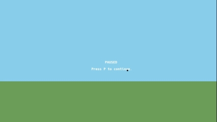
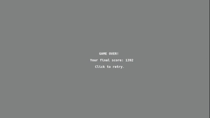

# Duck Hunt
## Gameplay
The gameplay is very similar to the original game, but there are some differences:

 - On each wave, a random number between 3 to 5 ducks appear on the scene.
 - Besides the default (normal) duck, there are also "special" ducks.
	 - Ice duck
		 - Color: blue.
		 - Special: Slows down other ducks for 3 seconds when killed.
		 - Score reward: base reward x 1.
		 - Chance of spawning: 3%.
	 - Golden duck
		 - Color: golden (beige).
		 - Special: x2 from base reward score.
		 - Score reward: base reward x 2.
		 - Chance of spawning: 10%
	 - Life duck
		 - Color: red, pink.
		 - Special: gives one life when killed.
		 - Score reward: base reward x1.
		 - Chance of spawning: 5%.
 - All spawned ducks have slightly different sizes and speeds; special ducks are usually smaller and faster than normal ones.
 - Amount of given ammo for each wave is: number of ducks x 2.
 - A random duck starts to escape after 2 seconds without shooting.
 - If you have spare ammo, and the last duck is hiding in grass, you might want to shoot just to extend the escape timer.
 - When a duck is escaping, it is flying straight upwards with x2 from its base speed, cannot be killed. Lives count is decremented.
 - When ammo is on zero: all ducks escape.
 - When lives fall below zero -- game is over.
 - Game can be paused by pressing P.
 - Game is not paused immediately, but when pause is requested, corresponding text appears on the top.
 - Game pauses on the next wave since pause was requested.
 - Game difficulty grows gradually.
 - To get to the next level of difficulty, you should clean (current difficulty x 2) waves.
 - Maximum level of difficulty is 12.
## Visual and implementation details
 - Wings flapping speed depends on duck's size and flying speed.
 - When shot, ducks start to fall by equation of free fall. "More upwards" they are facing, the less is initial falling velocity.
 - The crosshair is highlighted when a duck is hit.
 - Game window can be resized without impact on gameplay, however it does affect the HUD display, because of limitations of text render library included.
 - Hi-score is saved after closing the game. It is stored in "hiscore.txt" file (no cheating).

 ## Credits
 This game works with: https://github.com/UPB-Graphics/gfx-framework

 ## Media
   